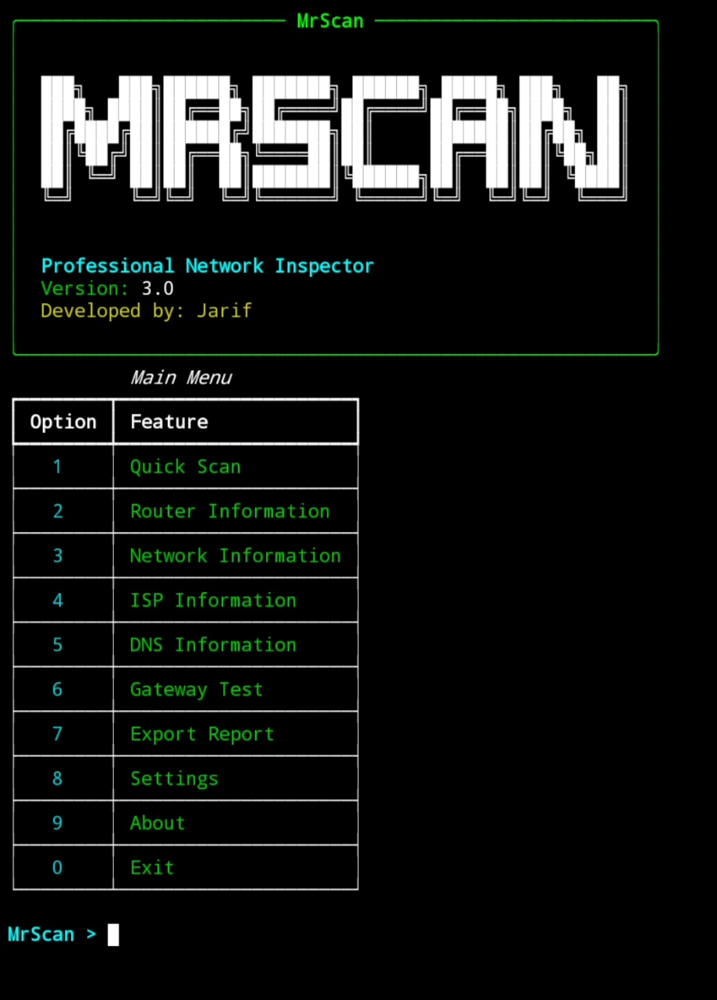

<p align="center">
  
  
</p>

# <p align="center">MrScan
<p align="center">
<p align="center">
  
</p>
<p align="center">–Professional Network Inspector–
<p align="center">

<a href="https://github.com/mr-fake-cmd/MrScan">

</a>

<a href="https://github.com/mr-fake-cmd/MrScan/blob/main/LICENSE">

</a>
<a href="https://instagram.com/jarif.67.khan">

</a>
<a href="https://github.com/mr-fake-cmd/MrScan">

</a>
<a href="https://github.com/mr-fake-cmd/MrScan/fork">

</a>
</p>

###### <p align="center">*This is official repository maintained by us*
###### <p align="center"> *[**@Jarif_khan**](https://www.instagram.com/jarif.67.khan/) ❤️*
---
### 🔍 What is MrScan??
MrScan is a lightweight and professional Network Inspector built specially for Termux and Linux. 

MrScan helps you quickly inspect your network connection and view important information such as: 

Private IP • Gateway • DNS • Public IP • ISP • ASN • Router • Network • Location 

Everything is presented through a clean, readable and beginner-friendly terminal interface. 

* `📋 Change Log — v3.0` 
```
•Professional Terminal UI✅
•Added⚡ Quick Network Scan✅
•Added📡 Router Information✅
•Added🌐 Network Information✅
•Added🏢 ISP / ASN Information✅
•Added🔎 DNS Information✅
•Added📶 Gateway Connectivity Test✅
•Added⏱️ Gateway Latency Detection✅
•Added🌍 Public / Private IP Detection✅
•Added📍 Location & Timezone Information✅
•Added📊 Network Report Export✅
•Added⚙️ Configurable Settings✅
•Added📱 Termux Support✅
•Added🐧 Linux Support✅
 ```
 ### Installation MrScan
  
* `Commands` for Termux
```
$ termux-setup-storage

$ pkg update && pkg upgrade -y

$ pkg install git python curl iproute2 net-tools iputils grep gawk -y

$ git clone https://github.com/mr-fake-cmd/MrScan

$ cd MrScan

$ pip install -r requirements.txt

$ python mrscan.py 
```
* `Commands` for Linux
```
$ sudo apt update

$ sudo apt install git python3 python3-pip curl iproute2 net-tools iputils-ping grep gawk -y

$ git clone https://github.com/mr-fake-cmd/MrScan

$ cd MrScan

$ pip3 install -r requirements.txt

$ python3 mrscan.py
```

### Screenshots

#### MrScan Main Interface:-


---
# <p align="center">Thank You for Using MrScan!
<p align="center">
If you found MrScan useful, consider giving the repository a ⭐ and sharing it with others. 

<p align="center">
  
  
</p>
